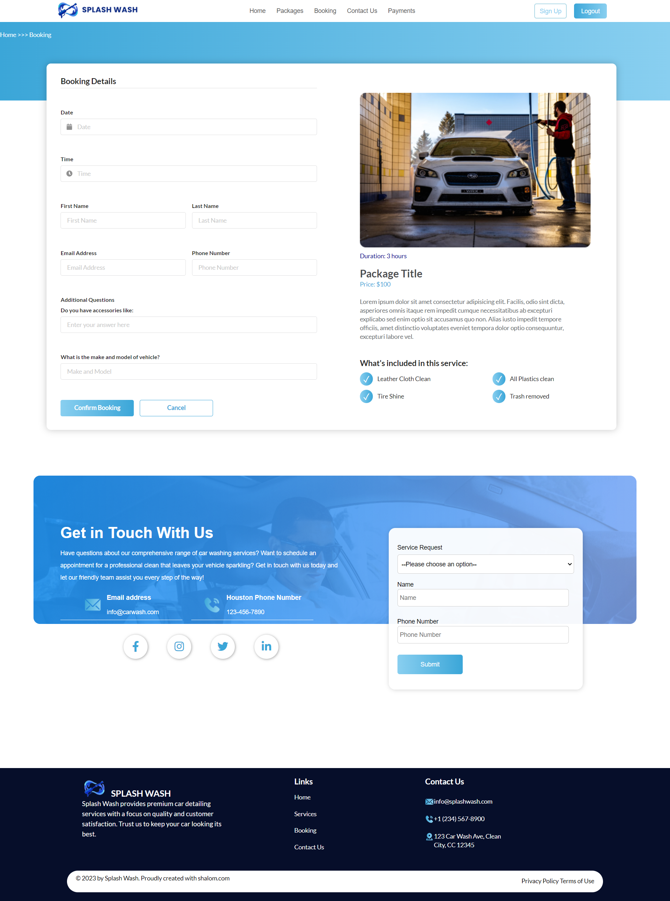
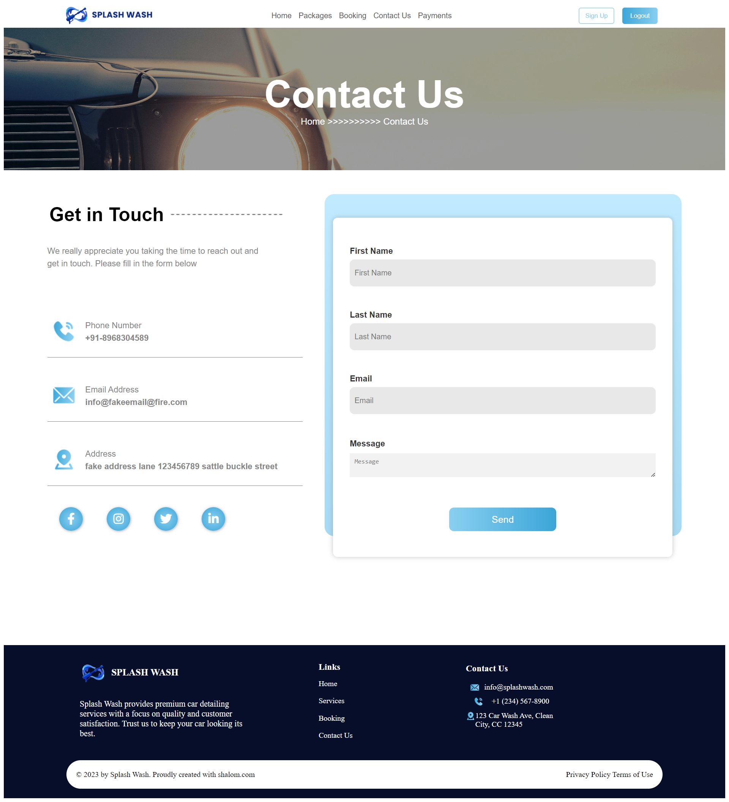
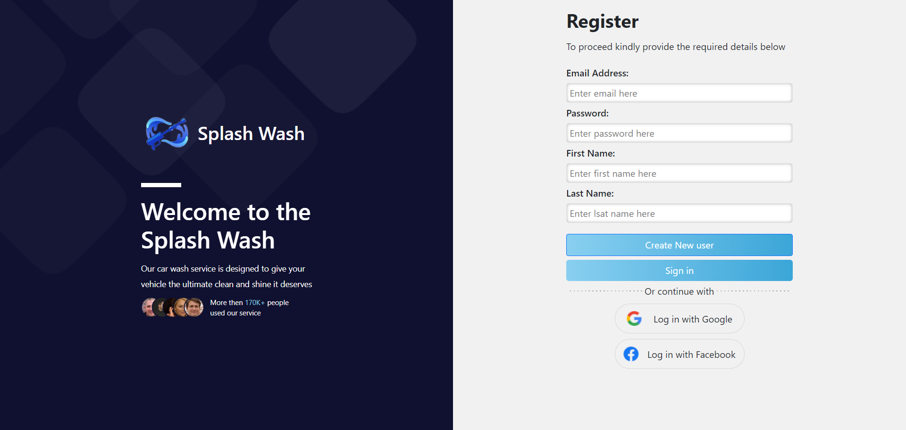

# splash-was-final

**Splash Wash** is an app designed for users to book and schedule appointments for car washes. The inspiration for this project came from my mentees, who wanted to start a car washing business. This app simplifies the booking process, allowing users to choose different car washing packages and services, proceed to payment, and checkout seamlessly.

#### STAR Interview Questions:

**Situation:**  
The purpose of Splash Wash was to create an application that helps users easily book car wash appointments. My mentees needed a platform to manage their car wash business efficiently. With Splash Wash, users can select from a variety of car wash packages, book appointments, and make payments online, ensuring a smooth and user-friendly experience.

**Task:**  
We began by designing a user-friendly interface that showcases different car wash packages. The project structure consists of two main folders: `dist` and `src`. The `dist` folder contains all the frontend code (HTML, CSS, JavaScript, and jQuery), while the `src` folder houses all the Firebase connections and backend logic. We used Firebase for real-time data handling and user authentication, and Stripe was integrated for payment processing. Additionally, we utilized Node.js, Express, and CORS for server-side operations, and dotenv for environment variable management. Webpack was employed to bundle the project efficiently.

**Action:**  
This project was managed on my personal GitHub account. We used a kanban board to organize tasks and ensure project guidelines were followed. Built with HTML, CSS, JavaScript, and jQuery, we focused on creating a simple yet effective front-end UI. The backend was implemented using Node.js and Express, with Firebase handling real-time data and user authentication, and Stripe managing payments. The main repository for Splash Wash can be found on my personal GitHub account.

**Result:**  
You can view the result of this project in the following demo.
Demo: [Splash Wash Demo Video]

**Technologies:**
- **HTML**
- **CSS**
- **JavaScript**
- **jQuery**
- **Node.js**
- **Express**
- **Firebase (Realtime Database, User Authentication)**
- **Stripe (Payment Processing)**
- **dotenv**
- **CORS**
- **Webpack**

**JF 2.4 Demonstrates commitment to continued professional development**

During the development of Splash Wash, I showcased a strong commitment to ongoing professional growth. Undertaking this project independently provided me with an opportunity to strengthen my skills in web development and frontend design. While I had prior experience with jQuery from my work at HP, integrating it comprehensively into a full-stack application like Splash Wash allowed me to deepen my understanding and proficiency.

Instead of using Bootstrap, I opted to leverage jQuery for its flexibility and extensive plugin ecosystem, which aligned with my goal to expand my toolkit for creating robust web applications. Mastering jQuery for this project involved studying various examples and applying them to enhance navigation and integrate dynamic functionalities seamlessly.

By successfully completing Splash Wash, I not only delivered a functional web application but also demonstrated my commitment to continuous learning and professional improvement. This experience has equipped me with invaluable skills that I am eager to apply in my professional role, contributing effectively to my team at HP and beyond. It underscores my proactive approach to advancing my capabilities and achieving sustainable growth in my career.

**JF 3.3 Understands how to develop effective user interfaces**

In crafting the user interface (UI) for Splash Wash, my focus was on delivering an intuitive and visually compelling experience for users. Utilizing jQuery and Firebase for the backend, I aimed to create a seamless frontend that offered both functionality and aesthetic appeal. I employed jQuery to enhance the UI's responsiveness and interactive elements, ensuring a user-friendly experience.

By incorporating dynamic elements such as sliders and interactive forms, I prioritized usability while maintaining a clean and modern design. The use of Firebase for backend operations enabled efficient data management, ensuring that user interactions were processed securely and reliably.

**JF 4.7 Understands how to apply algorithms, logic, and data structures**

In the development of Splash Wash, proficiency in algorithms, logic, and data structures was essential to implementing efficient frontend solutions. Using jQuery and Firebase, I applied logical structures to manage user sessions, process form submissions, and integrate Stripe for secure payment processing.

By structuring data effectively within Firebase, I ensured that user interactions were handled smoothly and securely. This approach not only met functional requirements but also enhanced the overall reliability and performance of the web application.

Through this project, I strengthened my understanding and application of algorithms and data structures in a practical context, equipping me with valuable skills applicable to future projects and professional endeavors.

